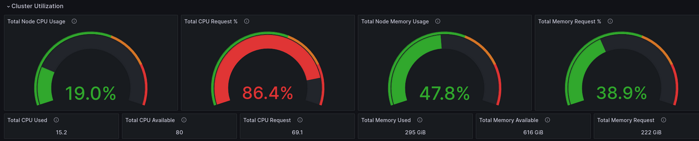
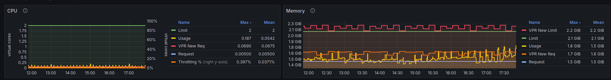

# VPR exporter
Developped by Arnaud Lemaignen

VPR stands for Verical Pod Recommender.
It is similar to [KRR](https://github.com/robusta-dev/krr) or [VPA](https://github.com/kubernetes/autoscaler/tree/master/vertical-pod-autoscaler) except it properly manage Java based containers (reason why it was developped).

## Why it so important to set requests/limits correctly ?

Requests tell the Kubernetes scheduler the minimum CPU and memory a Pod needs.
If you don’t set them (or set them too low), the scheduler might place Pods on nodes that can’t actually handle the workload → leading to resource starvation.
If you set them too high, your Pods might not get scheduled at all because Kubernetes thinks there’s not enough capacity.

One great way of optimizing a K8S cluster is to use [Karpenter](https://github.com/aws/karpenter-provider-aws) to automatically manage the number and type of appropriate nodes at best cost. Karpenter is using the cpu/mem requests in order to do that.
So it becomes even more important to have the right requests because otherwise the infra chosen by Karpenter will be either too high or too low or not in balance between CPU and memory.

For instance on the image below we can see that the memory requests and the aggregate memory usage are about the same which is OK. However the cpu requests are 5 times more than the aggregate usage, set up the lower cpu request will force Karpenter to choose a node with less CPUs which will lead to a cheaper compute cost.

In a nutshell if you have the right requests, Karpenter you will spin exactly the right computes at best cost for you.
Well this is definitely a FinOps good practice !

## What the app does ?

This app 
1. Find all deployment/sts/daemonset/cron jobs
2. Calculate CPU Request based on cpu usage and Mem Request/Limit based on usage (by default on the last 7 days) & JVM internals (mem after full gc and static mem on all GC collectors from java 8 to java 24)
3. Write the results to a CSV (to open in a spreadsheet for analytics)/yaml (as an helm value file)
4. Expose the results in a prometheus format
5. A [dashboard](https://github.com/arnaudlemaignen/grafana-dashboards/tree/master/prometheus-ds/vpr) is also available to follow historical information (as in VPA).

In the example below we see the VPR recommendations for CPU Req and for Mem Req/Limit based on the last 7 days of historical usage.

You can run the binary in local (to call adhoc along with a prometheus ingress) using ./run.sh or use the DockerFile to build the microservice (to run in a K8S cluster calling the prometheus service).

